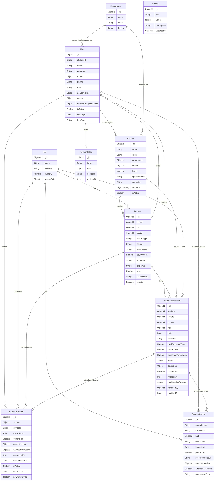

# 📊 توثيق قاعدة البيانات الكامل (Database Models Guide)

تم بناء قاعدة بيانات النظام باستخدام **MongoDB** وإدارتها برمجياً في الـ Backend باستخدام **Mongoose (ODM)**. تعتمد قاعدة البيانات على مبدأ المستندات (Documents) مع وجود علاقات منطقية (References) تربط الكائنات ببعضها لضمان تكامل البيانات وتسهيل الاستعلامات.

---

## 🗺️ مخطط علاقات قاعدة البيانات (Entity-Relationship Diagram)

يوضح المخطط التالي الجداول (Collections) المختلفة والعلاقات المتبادلة بينها:

---

## 🔍 شرح تفصيلي للجداول (Models Breakdown)

### 1. مستخدم النظام (User Model)
* **المسار:** [User.js](file:///d:/work-now/graduation-project/backend/src/models/User.js)
* **الوصف:** يمثل كافة مستخدمي النظام من أدمن ودكاترة وطلاب.

#### 📋 الحقول (Schema Fields)
| اسم الحقل | النوع | التحقق والخصائص (Validation & Options) | الوصف |
| :--- | :--- | :--- | :--- |
| `studentId` | `String` | `unique`, `sparse` (للطلاب فقط)، `trim` | الرقم الأكاديمي للطالب |
| `email` | `String` | `required`, `unique`, `lowercase`, `trim` | البريد الإلكتروني للمستخدم |
| `password` | `String` | `required`, `minlength: 6`, `select: false` (لا يرجع في الاستعلامات افتراضياً) | كلمة المرور المشفرة |
| `name.first` | `String` | `required`, `trim` | الاسم الأول للمستخدم |
| `name.last` | `String` | `required`, `trim` | الاسم الأخير للمستخدم |
| `phone` | `String` | `trim` | رقم الهاتف المحمول |
| `role` | `String` | `enum: ['student', 'doctor', 'admin']`, الافتراضي: `student` | صلاحيات ودور المستخدم بالنظام |
| `academicInfo.department` | `ObjectId` | مرجع لـ `Department` | القسم الأكاديمي (للطلاب) |
| `academicInfo.level` | `Number` | `min: 1`, `max: 6` | الفرقة/المستوى الدراسي (للطلاب) |
| `academicInfo.specialization`| `String` | `trim` | التخصص الدراسي إن وجد |
| `academicInfo.enrolledCourses`| `[ObjectId]` | مصفوفة مراجع لـ `Course` | المواد التي يدرسها الطالب بالترم |
| `device.deviceId` | `String` | معرف فريد يُولده السيرفر | معرف الجهاز الفريد (UUID) |
| `device.macAddress` | `String` | عنوان الماك الخاص بالجهاز | الماك أدريس الفيزيائي للجهاز |
| `device.registeredAt` | `Date` | تاريخ التسجيل | تاريخ ربط الجهاز بالحساب |
| `device.isVerified` | `Boolean`| الافتراضي: `false` | هل تم تفعيل وربط الجهاز بنجاح؟ |
| `deviceChangeRequest` | `Object` | يحتوي على حقول طلبات تغيير الأجهزة | لتغيير الماك أدريس عند شراء جهاز جديد |
| `isActive` | `Boolean`| الافتراضي: `true` | حالة الحساب (نشط/معطل) |
| `lastLogin` | `Date` | تلقائي | تاريخ آخر تسجيل دخول ناجح |
| `fcmToken` | `String` | اختياري | توكن الإشعارات (Firebase Cloud Messaging) |

#### 🛠️ الفهارس (Indexes)
* فهارس سريعة على الماك أدريس (`device.macAddress: 1`) والـ Device ID لضمان سرعة البحث عند دخول الطلاب للشبكة.
* فهرس على الدور والفرقة والقسم الدراسي لتسريع استخراج تقارير الطلاب.

#### ⚙️ دوال وخصائص الموديل (Methods & Statics & Virtuals)
* **Virtual Property (`fullName`):** تدمج الاسم الأول والأخير تلقائياً عند طلبها.
* **Pre-save Hook:** تشفير كلمة المرور تلقائياً باستخدام `bcrypt` قبل حفظها في قاعدة البيانات.
* **Method (`comparePassword`):** دالة لمقارنة كلمة المرور المدخلة بالهاش المخزن بالداتابيز أثناء تسجيل الدخول.
* **Method (`isDeviceMatch`):** تتحقق هل الماك أدريس أو الـ Device ID المدخل يطابق ما هو مسجل بالحساب أم لا.
* **Static (`findByDeviceIdentifier`):** تبحث عن الطالب بمطابقة الماك أدريس (سواء كان مفعلاً أو غير مفعل كحالة خاصة بالأدمن) أو الـ Device ID.

---

### 2. القسم الأكاديمي (Department Model)
* **المسار:** [Department.js](file:///d:/work-now/graduation-project/backend/src/models/Department.js)
* **الوصف:** يمثل الأقسام العلمية داخل الكليات (مثل قسم علوم الحاسب CS، نظم المعلومات IS).

#### 📋 الحقول (Schema Fields)
| اسم الحقل | النوع | التحقق والخصائص (Validation & Options) | الوصف |
| :--- | :--- | :--- | :--- |
| `name` | `String` | `required`, `unique`, `trim` | اسم القسم (مثال: قسم علوم الحاسب) |
| `code` | `String` | `required`, `unique`, `uppercase`, `trim` | كود القسم (مثال: CS) |
| `faculty` | `String` | `required`, `trim` | اسم الكلية التابع لها (مثال: حاسبات ومعلومات) |

---

### 3. المقرر الدراسي (Course Model)
* **المسار:** [Course.js](file:///d:/work-now/graduation-project/backend/src/models/Course.js)
* **الوصف:** يمثل المواد الدراسية المسجلة في الفصل الدراسي الحالي.

#### 📋 الحقول (Schema Fields)
| اسم الحقل | النوع | التحقق والخصائص (Validation & Options) | الوصف |
| :--- | :--- | :--- | :--- |
| `name` | `String` | `required`, `trim` | اسم المادة (مثال: هيكلة بيانات) |
| `code` | `String` | `required`, `unique`, `uppercase`, `trim` | كود المادة الأكاديمي (مثال: CS211) |
| `department` | `ObjectId` | مرجع لـ `Department`, `required` | القسم الأكاديمي التابع له المادة |
| `doctor` | `ObjectId` | مرجع لـ `User` (طبيبه), `required` | الدكتور المسؤول عن تدريس المادة |
| `level` | `Number` | `required`, `min: 1`, `max: 6` | المستوى الدراسي للمادة |
| `specialization` | `String` | `trim` | التخصص المحدد إن وجد |
| `semester` | `String` | `required`, `trim` | الترم الدراسي الحالي (مثال: Fall 2025) |
| `students` | `[ObjectId]` | مصفوفة مراجع لـ `User` (طلاب) | قائمة الطلاب المسجلين لحضور هذه المادة |
| `isActive` | `Boolean`| الافتراضي: `true` | هل المادة نشطة هذا الترم؟ |

---

### 4. القاعة الدراسية (Hall Model)
* **المسار:** [Hall.js](file:///d:/work-now/graduation-project/backend/src/models/Hall.js)
* **الوصف:** تمثل قاعات ومدرجات ومعامل الجامعة، وبها إعدادات نقطة الوصول (AP) الخاصة بكل قاعة.

#### 📋 الحقول (Schema Fields)
| اسم الحقل | النوع | التحقق والخصائص (Validation & Options) | الوصف |
| :--- | :--- | :--- | :--- |
| `name` | `String` | `required`, `unique`, `trim` | اسم القاعة (مثال: مدرج 1، معمل 3) |
| `building` | `String` | `required`, `trim` | اسم المبنى المتواجدة به القاعة |
| `capacity` | `Number` | `min: 1` | السعة الاستيعابية للطلاب |
| `accessPoint.ssid` | `String` | `trim` | اسم شبكة الواي فاي للقاعة (SSID) |
| `accessPoint.ipRange` | `String` | `trim` (مثال: `192.168.137`) | نطاق الـ IPs الافتراضي للشبكة المحلية |
| `accessPoint.apIdentifier`| `String`| `trim` | المعرف الفريد لنقطة الوصول (مثال: AP_101) |
| `accessPoint.apiKey` | `String` | `trim` (مخفي في مخرجات JSON) | مفتاح التوثيق السري الخاص بالسكريبت للاتصال بالسيرفر |
| `accessPoint.isOnline` | `Boolean`| الافتراضي: `false` | حالة الاتصال الحالية لنقطة الوصول |
| `accessPoint.lastSeen` | `Date` | تلقائي | تاريخ آخر نبضة قلب (Heartbeat) مستلمة من الـ AP |

#### ⚙️ دوال وخصائص الموديل (Methods & Statics)
* **Method (`updateApStatus`):** لتحديث حالة نقطة الوصول لتصبح متصلة وتحديث وقت `lastSeen` عند الاتصال.
* **Static (`findByApInfo`):** للبحث عن القاعة بمطابقة المعرف الفريد أو نطاق الـ IP للشبكة.

---

### 5. المحاضرة (Lecture Model)
* **المسار:** [Lecture.js](file:///d:/work-now/graduation-project/backend/src/models/Lecture.js)
* **الوصف:** يمثل الجدول الزمني الدراسي للمحاضرات (مكانها، زمانها، ونوعها).

#### 📋 الحقول (Schema Fields)
| اسم الحقل | النوع | التحقق والخصائص (Validation & Options) | الوصف |
| :--- | :--- | :--- | :--- |
| `course` | `ObjectId` | مرجع لـ `Course`, `required` | المادة التابع لها المحاضرة |
| `hall` | `ObjectId` | مرجع لـ `Hall`, `required` | القاعة التي تُعقد بها المحاضرة |
| `doctor` | `ObjectId` | مرجع لـ `User` (دكتور), `required` | دكتور المادة المحاضر |
| `lectureType` | `String` | `enum: ['lecture', 'section', 'lab']`, الافتراضي: `lecture` | نوع المحاضرة |
| `status` | `String` | `enum: ['scheduled', 'in-progress', 'completed', 'cancelled']` | حالة المحاضرة الحالية |
| `weekPattern` | `String` | `enum: ['weekly', 'odd', 'even']`, الافتراضي: `weekly` | نمط التكرار الأسبوعي |
| `dayOfWeek` | `Number` | `required`, `min: 0`, `max: 6` (0=الأحد، 6=السبت) | يوم المحاضرة الأسبوعي |
| `startTime` | `String` | `required`, صيغة: `HH:MM` | وقت بدء المحاضرة |
| `endTime` | `String` | `required`, صيغة: `HH:MM` | وقت نهاية المحاضرة |
| `level` | `Number` | `min: 1`, `max: 6` | الفرقة الدراسية المستهدفة |
| `specialization` | `String` | اختياري | التخصص المستهدف للمحاضرة |
| `isActive` | `Boolean`| الافتراضي: `true` | هل المحاضرة نشطة بالجدول؟ |

#### ⚙️ دوال وخصائص الموديل (Methods & Statics & Virtuals)
* **Virtual Property (`durationMinutes`):** تحسب المدة الإجمالية للمحاضرة بالدقائق من طرح وقت البداية والنهاية.
* **Method (`isCurrentlyActive`):** تتحقق هل اليوم والوقت الحالي يقعان ضمن نافذة المحاضرة الزمنية أم لا.
* **Static (`findActiveLecture`):** تبحث عن المحاضرة النشطة حالياً داخل قاعة معينة عن طريق التحقق من الوقت الحالي واليوم، أو إذا تم تفعيلها يدوياً لتصبح بحالة `in-progress`.

---

### 6. سجل الحضور (AttendanceRecord Model)
* **المسار:** [AttendanceRecord.js](file:///d:/work-now/graduation-project/backend/src/models/AttendanceRecord.js)
* **الوصف:** يمثل الحضور الفعلي والغياب لكل طالب لكل محاضرة في تاريخ محدد.

#### 📋 الحقول (Schema Fields)
| اسم الحقل | النوع | التحقق والخصائص (Validation & Options) | الوصف |
| :--- | :--- | :--- | :--- |
| `student` | `ObjectId` | مرجع لـ `User`, `required` | الطالب صاحب السجل |
| `lecture` | `ObjectId` | مرجع لـ `Lecture`, `required` | المحاضرة التابع لها السجل |
| `course` | `ObjectId` | مرجع لـ `Course`, `required` | المقرر الدراسي التابع له السجل |
| `hall` | `ObjectId` | مرجع لـ `Hall`, `required` | القاعة المنعقد فيها المحاضرة |
| `date` | `Date` | `required` (بدون وقت لتسهيل الفلترة) | تاريخ اليوم الدراسي |
| `sessions` | `[Object]` | مصفوفة كائنات تحتوي على `checkIn` و `checkOut` كتواريخ | فترات الدخول والخروج التي قام بها الطالب |
| `totalPresenceTime`| `Number` | الافتراضي: `0` (بالدقائق) | إجمالي مدة البقاء داخل القاعة متصلاً |
| `lectureTime` | `Number` | الافتراضي: `0` (بالدقائق) | مدة المحاضرة الكلية |
| `presencePercentage`| `Number`| الافتراضي: `0` | النسبة المئوية للحضور |
| `status` | `String` | `enum: ['present', 'absent', 'excused', 'in-progress']` | حالة حضور الطالب النهائية |
| `deviceInfo.macAddress` | `String`| اختياري | الماك أدريس للجهاز الذي اتصل بالـ WiFi |
| `deviceInfo.deviceId` | `String`| اختياري | معرف جهاز الطالب الفريد |
| `isFinalized` | `Boolean`| الافتراضي: `false` | هل تم اعتماد السجل نهائياً بحساب النسبة؟ |
| `finalizedAt` | `Date` | تلقائي | تاريخ قفل واعتماد السجل |
| `modificationReason`| `String`| للعمليات اليدوية فقط | سبب تعديل السجل يدوياً من الدكتور |
| `modifiedBy` | `ObjectId` | مرجع لـ `User` (الدكتور) | الدكتور الذي عدل السجل يدوياً |
| `modifiedAt` | `Date` | تلقائي | تاريخ التعديل اليدوي |

#### 🛠️ الفهارس (Indexes)
* **Unique Compound Index (`student: 1, lecture: 1, date: 1`):** يضمن عدم تكرار سجل حضور لنفس الطالب في نفس المحاضرة ونفس اليوم نهائياً.

#### ⚙️ دوال وخصائص الموديل (Methods & Statics)
* **Method (`addCheckIn`):** تُضيف وقت دخول جديد لمصفوفة الـ `sessions`.
* **Method (`addCheckOut`):** تُضيف وقت خروج وتغلق آخر جلسة اتصال مفتوحة للـ sessions.
* **Method (`calculatePresence`):** تحسب مجموع فترات الاتصال بالدقائق بناءً على جلسات الدخول والخروج.
* **Method (`finalize`):** تغلق السجل نهائياً، وتحسب نسبة الحضور الإجمالية، وتقارنها بالنسبة المطلوبة (85% مثلاً) لتحديد الحالة النهائية للطالب (حاضر/غائب).

---

### 7. جلسة الطالب اللحظية (StudentSession Model)
* **المسار:** [StudentSession.js](file:///d:/work-now/graduation-project/backend/src/models/StudentSession.js)
* **الوصف:** يمثل الحالة اللحظية (الآنية) للطالب المتصل بالشبكة حالياً. يُستخدم لعرض بيانات المحاضرة المتصل بها حالياً الطالب على الموبايل كـ Polling سريع جداً.

#### 📋 الحقول (Schema Fields)
| اسم الحقل | النوع | التحقق والخصائص | الوصف |
| :--- | :--- | :--- | :--- |
| `student` | `ObjectId` | مرجع لـ `User`, `required` | الطالب المتصل |
| `deviceId` | `String` | معرف الجهاز | الـ Device ID الخاص بالطالب |
| `macAddress` | `String` | الماك أدريس | عنوان الماك المستخدم حالياً |
| `currentHall` | `ObjectId` | مرجع لـ `Hall` | القاعة التي يتصل الطالب بواي فاي الخاص بها الآن |
| `currentLecture` | `ObjectId` | مرجع لـ `Lecture` | المحاضرة الجارية في القاعة حالياً |
| `attendanceRecord`| `ObjectId`| مرجع لـ `AttendanceRecord` | سجل الحضور المرتبط بهذه الجلسة |
| `connectedAt` | `Date` | تاريخ وساعة | وقت بداية الاتصال الفعلي بالشبكة |
| `disconnectedAt` | `Date` | تاريخ وساعة | وقت انقطاع الاتصال الفعلي بالشبكة |
| `isActive` | `Boolean`| الافتراضي: `true` | هل الطالب متصل حالياً ونشط بالشبكة؟ |
| `lastActivity` | `Date` | الافتراضي: `Date.now` | وقت آخر اتصال أو تأكيد للشبكة |
| `networkVerified` | `Boolean`| الافتراضي: `false` | هل تم التحقق التام من الشبكة ومطابقتها؟ |

---

### 8. سجل أحداث الشبكة (ConnectionLog Model)
* **المسار:** [ConnectionLog.js](file:///d:/work-now/graduation-project/backend/src/models/ConnectionLog.js)
* **الوصف:** يقوم بتسجيل وحفظ كافة أحداث الدخول والخروج التي يرسلها سكريبت نقطة الوصول بشكل خام (Raw) لأغراض الفحص الفني وحل المشاكل.

#### 📋 الحقول (Schema Fields)
| اسم الحقل | النوع | التحقق والخصائص | الوصف |
| :--- | :--- | :--- | :--- |
| `macAddress` | `String` | `required`, `trim` | الماك أدريس للجهاز الذي دخل أو خرج |
| `ipAddress` | `String` | `trim` | الـ IP Address الخاص بالجهاز |
| `hall` | `ObjectId` | مرجع لـ `Hall`, `required` | القاعة التي تم رصد الجهاز بها |
| `eventType` | `String` | `enum: ['device-connected', 'device-disconnected']` | نوع الحدث المستلم من السكريبت |
| `timestamp` | `Date` | `required`, الافتراضي: `Date.now` | وقت رصد الحدث في القاعة |
| `processed` | `Boolean`| الافتراضي: `false` | هل قام الباك-إند بمعالجة هذا الحدث بنجاح؟ |
| `processingResult`| `String`| `trim` | تفاصيل نتيجة المعالجة (مثل: تم تسجيل حضور / لم يتم العثور على طالب) |
| `matchedStudent` | `ObjectId` | مرجع لـ `User` | الطالب الذي تمت مطابقة الماك أدريس معه |
| `attendanceRecord`| `ObjectId`| مرجع لـ `AttendanceRecord` | سجل الحضور الذي تأثر بهذا الحدث |
| `processingError` | `String` | اختياري | أي أخطاء برمجية حدثت أثناء المعالجة |

---

### 9. الإعدادات العامة (Setting Model)
* **المسار:** [Setting.js](file:///d:/work-now/graduation-project/backend/src/models/Setting.js)
* **الوصف:** لتخزين ثوابت وإعدادات النظام القابلة للتغيير ديناميكياً من الأدمن (مثل: وقت التأخير، نسبة الحضور المطلوبة).

#### 📋 الحقول (Schema Fields)
| اسم الحقل | النوع | التحقق والخصائص | الوصف |
| :--- | :--- | :--- | :--- |
| `key` | `String` | `required`, `unique`, `trim` | اسم الإعداد الفريد (مثل: `MIN_PRESENCE_PERCENTAGE`) |
| `value` | `Mixed` | `required` (أي نوع بيانات: رقم، نص، كائن) | قيمة الإعداد المخزنة |
| `description` | `String` | `trim` | شرح وتوضيح لوظيفة هذا الإعداد |
| `updatedBy` | `ObjectId` | مرجع لـ `User` (الأدمن) | الأدمن الذي قام بتحديث هذا الإعداد |

---

### 10. توكن التجديد (RefreshToken Model)
* **المسار:** [RefreshToken.js](file:///d:/work-now/graduation-project/backend/src/models/RefreshToken.js)
* **الوصف:** يُستخدم لحفظ الـ Refresh Tokens للتوثيق المستمر ومنع المستخدم من الاضطرار لتسجيل الدخول مراراً وتكراراً (سواء للويب أو الموبايل).

#### 📋 الحقول (Schema Fields)
| اسم الحقل | النوع | التحقق والخصائص | الوصف |
| :--- | :--- | :--- | :--- |
| `token` | `String` | `required`, `unique` | قيمة الـ JWT Refresh Token المشفرة |
| `user` | `ObjectId` | مرجع لـ `User`, `required` | المستخدم صاحب التوكن |
| `deviceId` | `String` | اختياري | معرف الجهاز المرتبط (للموبايل) |
| `expiresAt` | `Date` | `required` | تاريخ انتهاء صلاحية التوكن |

#### ⚙️ دوال وخصائص الموديل (Statics)
* **Index TTL (`expiresAt: 1`):** تم ضبط فهرس انتهاء الصلاحية بحيث يتم مسح التوكن تلقائياً من الداتابيز بمجرد وصول الوقت لقيمة الحقل `expiresAt` دون الحاجة لتدخل برمجي لتنظيف قاعدة البيانات.
* **Static (`removeAllForUser`):** دالة لمسح كافة توكنز التجديد الخاصة بمستخدم معين (تُستخدم عند تغيير كلمة المرور لتسجيل خروجه من كافة الأجهزة).
