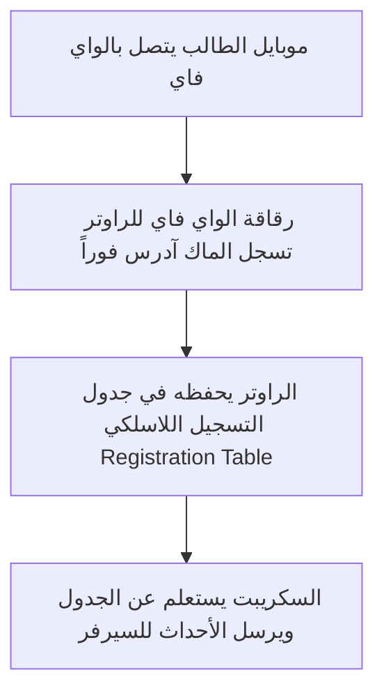
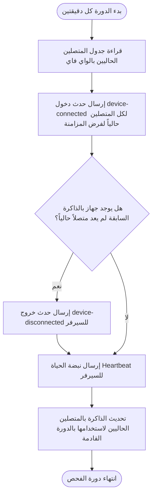
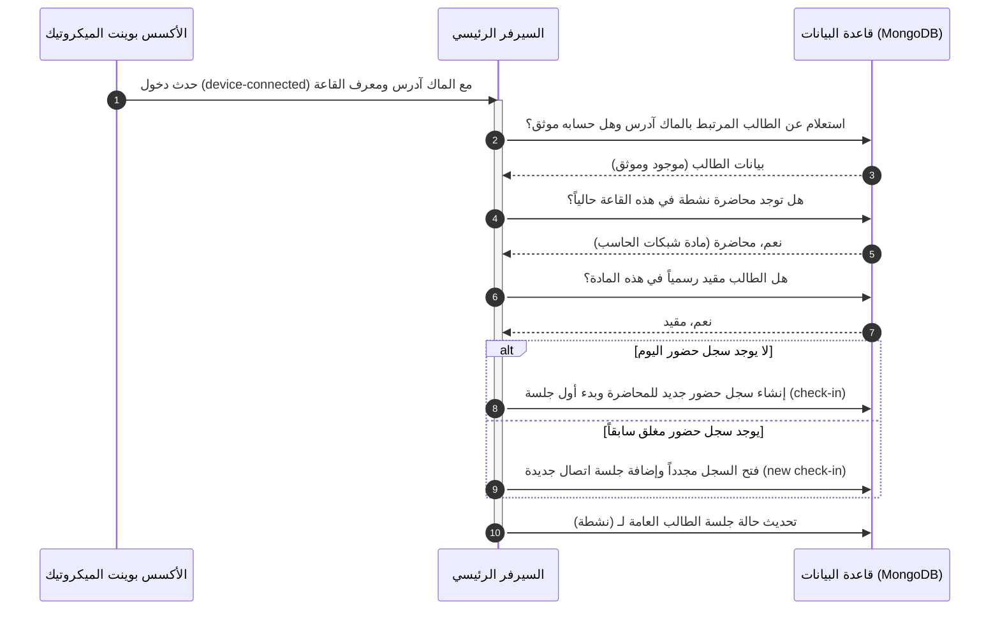
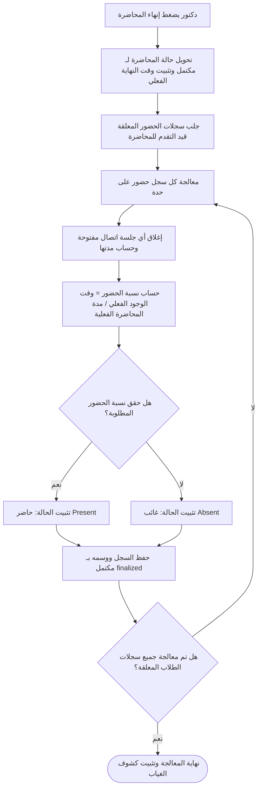

# الفصل الأول: الفكرة البرمجية العامة وآلية تسجيل الحضور والغياب من الصفر

يركز هذا الفصل على تقديم شرح مستفيض ومنطقي للفكرة الأساسية التي بني عليها هذا المشروع، ويوضح بالتفصيل كيف يعمل نظام تسجيل الحضور والغياب الذكي تلقائياً باستخدام شبكة الواي فاي وعبر الاستعانة بجهاز الميكروتيك، مع تتبع العمليات من لحظة دخول الطالب للقاعة وحتى استقرار النتيجة النهائية للحضور في قاعدة البيانات.

---

## 1️⃣ مقدمة: لماذا تسجيل الحضور عبر شبكة الواي فاي؟

تواجه المؤسسات الأكاديمية والجامعات تحديات مستمرة في إدارة عملية تسجيل الحضور والغياب في المحاضرات والندوات. ومن خلال تحليل الطرق التقليدية، نجد العديد من العيوب الجوهرية:

- **التحضير الورقي التقليدي:** يستهلك وقتاً طويلاً من وقت المحاضرة الثمين، كما يفتح باب التلاعب من خلال قيام بعض الطلاب بتسجيل زملائهم الغائبين.
- **البصمة البيومترية:** تتطلب أجهزة متخصصة ومكلفة عند كل قاعة، وتسبب طوابير طويلة وازدحاماً شديداً عند الدخول والخروج، فضلاً عن كونها وسيلة لانتقال العدوى والأمراض.
- **رموز الاستجابة السريعة (QR Codes):** على الرغم من حداثتها، إلا أنه يمكن التلاعب بها بسهولة عن طريق التقاط صورة للكود المعروض على الشاشة وإرساله للطلاب الغائبين لتسجيل حضورهم من منازلهم.

### الحل المقترح: نظام الحضور الذكي المعتمد على الواي فاي

يعيد هذا النظام صياغة الفكرة من خلال استغلال الهواتف الذكية للطلاب والبنية التحتية اللاسلكية المتوفرة في القاعات الدراسية. يعتمد الحل على منطق بسيط ولكنه صارم: **"إذا كان هاتفك الذكي متصلاً بشبكة الواي فاي الخاصة بالقاعة الدراسية أثناء وقت المحاضرة، وبنسبة الوقت المطلوبة، فأنت حاضر فعلياً داخل القاعة"**.

يتميز هذا النهج بالتالي:

1.  **بدون تدخل بشري:** لا يضطر الأستاذ للنداء على الأسماء، ولا يضطر الطالب للوقوف في طوابير أو مسح كود.
2.  **إثبات الوجود الجغرافي الفعلي:** نظراً لأن مدى تغطية شبكة الواي فاي الخاصة بجهاز الأكسس بوينت داخل القاعة محدود جداً بجدران الغرفة، فلا يمكن للطالب المتواجد خارج القاعة أو الكلية الاتصال بالشبكة وتسجيل الحضور.
3.  **الاستمرارية والدقة:** لا يسجل الحضور لمجرد لحظة واحدة (مثل الـ QR)، بل يتتبع وجود الطالب طوال فترة المحاضرة لضمان عدم مغادرته مبكراً.

---

## 2️⃣ منطق الكشف: جدول التسجيل اللاسلكي (Wireless Registration Table)

عشان نضمن دقة 100% في تسجيل الحضور، النظام بتاعنا بيبعد تماماً عن الطرق التقليدية المتعبة وبيعتمد على آلية كشف ذكية وسهلة بتشتغل مباشرة من جوة راوتر الميكروتيك:

### إزاي العملية دي بتشتغل؟

- بمجرد ما موبايل الطالب يلقط إشارة الواي فاي الخاصة بالقاعة الدراسية ويتصل بيها، رقاقة الواي فاي (Wireless Chip) بتاعة الميكروتيك بتسجل الماك آدرس (MAC Address) الحقيقي والمميز لجهازه فوراً في جدول داخلي اسمه **جدول التسجيل اللاسلكي (Wireless Registration Table)** على مستوى الطبقة الثانية من الشبكة (Layer 2).
- **ليه الطريقة دي عبقرية؟**
  لأن الميكروتيك هنا بيسأل نفسه مباشرة: "مين متصل بيا دلوقتي حالا؟" بدل ما يحاول يبعت بنج (Ping) للموبايلات. الموبايلات الذكية الحديثة أول ما شاشتها بتتقفل بتدخل في وضع النوم وبتعمل بلوك لأي طلب Ping خارجي، لكن اتصال الموبايل الفيزيائي بالراوتر بيفضل شغال ومستحيل الموبايل يخفيه عن شريحة الراوتر نفسه طالما متصل بالشبكة. فكده الطالب بيتسجل حضور حتى لو تليفونه مقفول في جيبه!

---

## 3️⃣ دور جهاز الميكروتيك (hAP ax2) كحسّاس ذكي

جهاز الميكروتيك hAP ax2 في مشروعنا مش مجرد راوتر بيوزع إنترنت عادي؛ ده شغال كـ "حسّاس ذكي" لتحديد مكان الطلاب (Location Sensor) جوة المدرج. دوره بيتلخص في تلات نقاط أساسية:

1.  **بيشيل عدد كبير من الطلاب في نفس الوقت (Wi-Fi 6):**
    الراوتر ده بيدعم الجيل السادس من الواي فاي، وده معناه إنه يقدر يستحمل مئات الهواتف الذكية متصلة في نفس الثانية وبسرعة تامة من غير ما الشبكة تقع أو تهنج.
2.  **شغال بدماغه وبيوفر موارد السيرفر (Edge Computing):**
    بدل ما نتعب السيرفر ونخليه هو اللي يراقب المتصلين طول الوقت، معالج الميكروتيك بيشغل السكريبت جواه ويقارن المتصلين ذاتياً، وفي الآخر بيبعت للسيرفر النتائج الجاهزة والأحداث بس (فلان دخل، فلان خرج).
3.  **أمان وتأمين تام للقاعة (Security Key):**
    الراوتر بيتصل بالسيرفر بمفتاح سري (API Key) فريد؛ وده بيمنع أي حد برا القاعة إنه يحاول يبعت إشارات وهمية أو يزور بيانات الحضور من تليفونه الشخصي.

---

## 4️⃣ خوارزمية تتبع الأجهزة وحساب الأحداث (Core Monitoring Algorithm)

يعمل السكريبت المجدول داخل الميكروتيك كحلقة تكرارية مستمرة تعمل كل دقيقتين. يوضح المخطط المنطقي التالي خوارزمية عمل السكريبت في كل دورة تشغيل:

### إزاي العملية دي بتتم بالبلدي؟

1.  **مقارنة القديم بالجديد:** الراوتر مخزن في ذاكرته قائمة الموبايلات اللي كانت متصلة بالواي فاي في الفحص اللي فات (من دقيقتين) لمتابعة الخروج.
2.  **حدث الدخول والمزامنة الفورية (Sync & Connect Events):** السكريبت بيجيب كل الأجهزة المتصلة بالواي فاي حالياً، وبيبعت لكل واحد منهم حدث اتصال (`device-connected`) للسيرفر في كل دورة. ده بيشتغل كـ "إجبار للمزامنة (Forces Sync)" عشان لو السيرفر وقع أو أعاد تشغيل نفسه، يستقبل فوراً الأجهزة المتواجدة حالياً وميفقدش حالتهم.
3.  **حدث الخروج (طالب مشي أو قفل الواي فاي):** السكريبت بيبص على القائمة القديمة المتسجلة في الذاكرة؛ لو لقى ماك آدرس كان موجود في الدورة السابقة واختفى في الدورة الحالية، بيفهم إن الطالب مشي أو قفل الواي فاي، ويبعت إشارة للسيرفر: (نوع الحدث = خروج، ماك موبايل الطالب، معرّف القاعة).
4.  **نبضة الحياة (الهارت بيت):** عشان السيرفر يفضل متطمن إن راوتر القاعة شغال وسليم، الراوتر بيبعت إشارة دورية ثابتة كل دقيقتين بماك وهمي أصفار، عشان القاعة تفضل منورة باللون الأخضر في لوحة التحكم.

---

## 5️⃣ دورة حياة تسجيل الحضور والغياب (End-to-End Workflow)

عندما تصل هذه الأحداث إلى السيرفر الرئيسي للنظام، يقوم بمعالجتها وفق منطق متكامل يربط بين الأجهزة والطلاب والمحاضرات المقامة:

### أ) إيه اللي بيحصل لما موبايل الطالب يتصل بالواي فاي؟ (Device Connected Flow):

أول ما الميكروتيك يبعت إشارة إن ماك آدرس معين اتصل، الباك إند بيشغل اللوجك ده:
1.  **التعرف على الطالب:** السيرفر بيدور بالماك آدرس في قاعدة البيانات؛ لو لقى طالب مربوط بيه والطلب متوثق ومعتمد (Device Binding)، بيكمل اللوجك.
2.  **تحديد المكان والمحاضرة:** بيطابق معرّف الراوتر بالقاعة، ويبحث: "هل فيه محاضرة شغالة دلوقتي في القاعة دي؟".
3.  **التحقق الأكاديمي:** بيتأكد إن الطالب ده مسجل فعلياً في مادة المحاضرة دي.
4.  **تسجيل الدخول:** 
    *   لو ده أول اتصال للطالب النهاردة: بيكريت له سجل حضور جديد (`AttendanceRecord`) للكلية النهاردة ويخليه "قيد التقدم" (`in-progress`)، ويفتح له أول جلسة حضور (Check-in) بالوقت الحالي.
    *   لو الطالب كان اتصل قبل كده وفصل ودخل تاني: بيفتح نفس سجل الحضور بتاع اليوم ويكريت له جلسة دخول جديدة تابعة ليه، ويربط جلسته النشطة بالنظام.

### ب) إيه اللي بيحصل لما اتصال الطالب ينفصل؟ (Device Disconnected Flow):

أول ما الميكروتيك يبعت إشارة إن الماك آدرس ده فصل أو مبقاش موجود في التغطية:
1.  **تحديد الجلسة:** السيرفر بيجيب الجلسة النشطة للطالب ده في القاعة.
2.  **إغلاق الجلسة الفرعية:** بيحط وقت خروج (Check-out) للجلسة دي في سجل حضور الطالب.
3.  **حساب وقت الوجود المؤقت:** بيطرح وقت الدخول الأخير من وقت الخروج الحالي بالدقائق، ويزود الدقائق دي على إجمالي الوقت المتراكم لوجوده في المحاضرة (`totalPresenceTime`).
4.  **إبقاء السجل مفتوحاً:** السيرفر بيقفل جلسة الاتصال بس، لكن بيسيب سجل حضور المحاضرة الكلي في حالة "قيد التقدم" (`in-progress`) ومبيقفلهوش؛ تحسباً لأن الطالب تليفونه فصل شبكة وهيرجع يتصل تاني أو خرج لدقائق بسيطة وعاد، وبكده ميكنش ضاع عليه وقت الحضور اللي فات.

---

## 6️⃣ منطق إنهاء المحاضرة واحتساب القرار النهائي (Finalization Engine)

لا يتم اتخاذ القرار النهائي بشأن حضور الطالب أو غيابه بمجرد دخوله أو خروجه، بل يظل الأمر معلقاً حتى يقوم الدكتور بإنهاء المحاضرة رسمياً من لوحة التحكم الخاصة به.

### منطق العمليات عند الإغلاق:

1.  **إغلاق جميع الجلسات المفتوحة:** يبحث السيرفر عن أي طالب انتهت المحاضرة وهو لا يزال متصلاً بالشبكة (لم يرسل له حدث خروج)، ويقوم بإغلاق جلسته قسرياً بلحظة إنهاء المحاضرة وحساب مدتها الأخيرة وإضافتها لوقته المتراكم.
2.  **حساب المدة الفعلية للمحاضرة:** تحسب المدة الإجمالية بالدقائق بناءً على وقت البدء الفعلي ووقت النهاية الفعلي للمحاضرة (وليس الموعد المجدول نظرياً)، مما يضمن العدالة للطلاب في حال تأخر بدء المحاضرة لأسباب تقنية أو تنظيمية.
3.  **المقارنة بالنسبة المئوية المطلوبة:**
    - يستدعي النظام القيمة المحددة في الإعدادات العامة للحد الأدنى للحضور (مثال: $50\%$).
    - تطبق المعادلة التالية على كل طالب:
      $$\text{نسبة الحضور الفعلي} = \left( \frac{\text{إجمالي دقائق التواجد}}{\text{المدة الفعلية للمحاضرة}} \right) \times 100$$
    - إذا حقق الطالب النسبة المطلوبة، يُكتب في سجله النهائي **حاضر (Present)**.
    - إذا لم يحقق النسبة المطلوبة (حتى لو حضر ربع ساعة مثلاً من محاضرة مدتها ساعتين)، يُكتب في سجله النهائي **غائب (Absent)**.
4.  **تثبيت السجلات:** يتم غلق السجلات كلياً وتاريخياً لمنع حدوث أي تعديل تلقائي لاحق عليها.

---

## 7️⃣ الجلسة النشطة (StudentSession) مقابل سجل الحضور (AttendanceRecord)

يفصل النظام منطقياً بين مفهومين جوهريين في قواعد البيانات لضمان المرونة الكاملة:

| الميزة                       | الجلسة النشطة (`StudentSession`)                             | سجل الحضور (`AttendanceRecord`)                                                     |
| :--------------------------- | :----------------------------------------------------------- | :---------------------------------------------------------------------------------- |
| **التعريف**                  | تمثل التواجد الفيزيائي الفعلي للهاتف المتصل بالواي فاي الآن. | يمثل المستند الأكاديمي الرسمي لحضور الطالب لمادة معينة اليوم.                       |
| **الصلاحية**                 | مؤقتة (تُحذف أو تصبح غير نشطة بمجرد انقطاع الاتصال).         | دائمة ومحفوظة في سجلات الطالب الأكاديمية مدى الحياة.                                |
| **البيانات المخزنة**         | الماك آدرس، القاعة الحالية، وقت الاتصال، المحاضرة الحالية.   | تفاصيل الدخول والخروج، النسبة المئوية، إجمالي الدقائق، والقرار النهائي (حاضر/غائب). |
| **الفائدة الخاصة بالانتقال** | تُستخدم لتمرير الطالب تلقائياً للمحاضرة التالية دون انقطاع.  | تُستخدم لإصدار كشوف الحضور والغياب والحرمان الأكاديمي.                              |

### منطق الانتقال التلقائي بين المحاضرات المتتالية (Session Auto-Transition Logic)

إذا كان لدى الطلاب محاضرتين متتاليتين في نفس القاعة (مثال: محاضرة من الساعة 9 إلى 11، ومحاضرة تالية من 11 إلى 1):

- عند قيام الدكتور الأول بإنهاء محاضرته، يقوم السيرفر بإنهاء وحساب سجل الحضور الأول للطلاب.
- لكن **لا يتم إغلاق أو حذف الجلسات الفيزيائية (`StudentSession`)** لهواتف الطلاب المتصلين فعلياً بالواي فاي؛ حيث يظلون متصلين بالراوتر.
- بمجرد قيام الدكتور الثاني ببدء المحاضرة التالية من لوحة تحكمه، يقرأ السيرفر فوراً جدول الجلسات النشطة بالقاعة، ويكتشف وجود الطلاب المتصلين بالشبكة حالياً، ويقوم تلقائياً بإنشاء سجلات حضور جديدة لهم للمادة الثانية فوراً، دون أن يضطر الطلاب للقيام بأي خطوة أو إعادة الاتصال.
