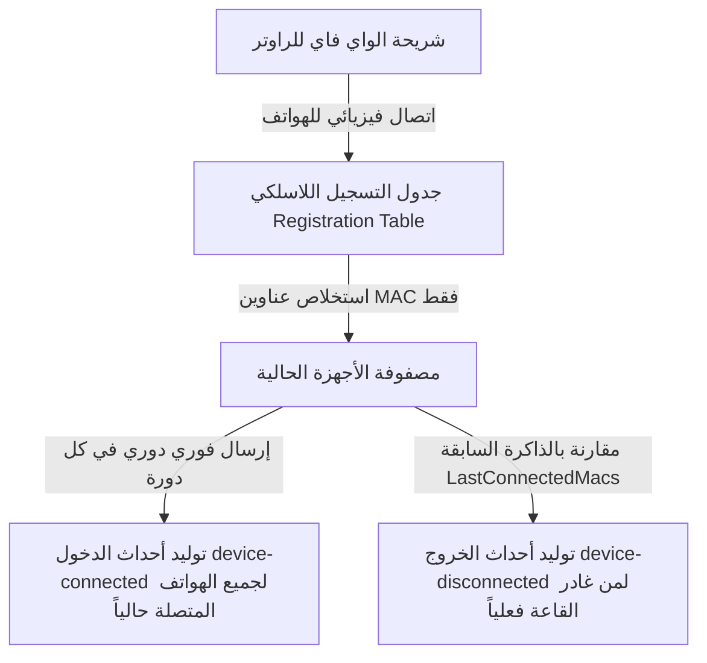
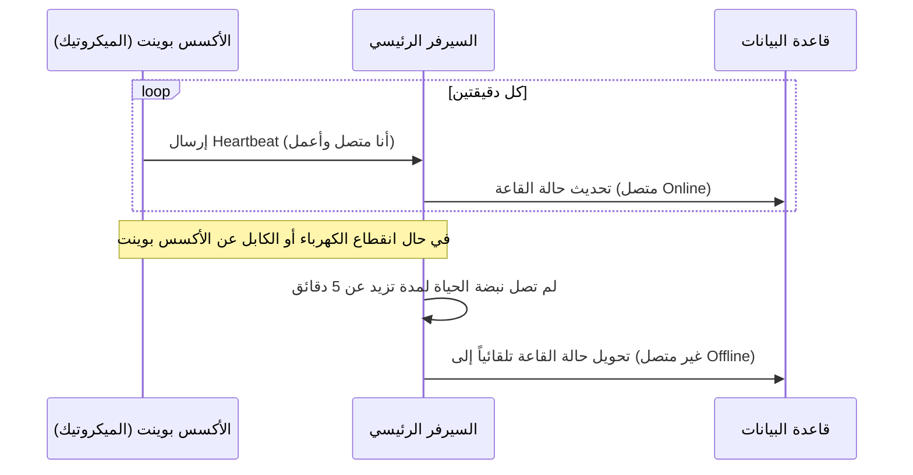

# الفصل الثاني: منطق عمل راوتر الميكروتيك والربط الشبكي (MikroTik & Networking Logic)

في الفصل الثاني! في الجزء ده من الدليل، هنشرح بالتفصيل الممل إزاي راوتر الميكروتيك (MikroTik hAP ax2) بيشتغل كحسّاس ذكي جوة قاعات المحاضرات، وإزاي بيرتبط بالشبكة مع السيرفر الرئيسي، والخطوات اللي عملناها لتجاوز أنظمة الحماية والصلاحيات من غير ما نوقع في أي مشاكل شبكية.

---

## 1️⃣ خوارزمية السكريبت والتعامل مع ذاكرة الراوتر (Memory Management)

عشان الراوتر يقدر يلقط دخول وخروج الطلاب من غير ما نتقل عليه ومن غير ما نستهلك المعالج أو الذاكرة بتاعته، عملنا خوارزمية ذكية وخفيفة بتعتمد على نوعين من الذاكرة المؤقتة جوة نظام تشغيل الراوتر (RouterOS):

### أ) المتغيرات المحلية (Local Variables):

- **إيه هي؟** دي مساحات تخزين مؤقتة جداً، بتتخلق أول ما السكريبت يبدأ ويشتغل، وتتمسح وتتطير تماماً من الذاكرة بمجرد ما السكريبت يخلص شغله (يعني بتعيش لثوانٍ معدودة).
- **بنستخدمها في إيه؟** بنخزن فيها الإعدادات الثابتة لكل قاعة (زي اسم القاعة `apIdentifier` ورابط السيرفر `backendUrl` والمفتاح السري للراوتر `apiKey`)، وكمان بنحفظ فيها لستة الأجهزة المتصلة بالواي فاي في اللحظة دي بالذات عشان نقارنها.

### ب) المتغيرات العامة (Global Variables):

- **إيه هي؟** دي مساحات تخزين دائمة بتفضل محفوظة في ذاكرة الراوتر العشوائية (RAM) حتى بعد ما السكريبت يخلص ويقفل، ومش بتتمسح إلا لو الراوتر نفسه اتعمل له إعادة تشغيل (Reboot).
- **بنستخدمها في إيه؟** دي بقى **"الذاكرة التاريخية للراوتر"**، وبنحفظ فيها لستة الأجهزة اللي كانت متصلة في الفحص اللي فات (من دقيقتين) في متغير اسمه (`LastConnectedMacs`).
- **منطق أول تشغيل (Initialization):** أول ما الراوتر يشتغل خالص، المتغير ده بيبقى مش موجود (قيمته `nil`)، فالسكريبت بذكاء بيعرف ده ويقوم مبرمجه ومهيأه كمصفوفة (Array) فاضية عشان يبدأ يملأها بالمتصلين.

---

## 2️⃣ منطق الاستعلام عن العتاد وتجميع البيانات (Hardware Querying)

السكريبت بيجيب البيانات مباشرة من قطع الهاردوير (Hardware) الخاصة بكارت الواي فاي عبر الخطوات دي:



1.  **الاستعلام المباشر (Direct Query):** السكريبت بيبعت أمر لنظام الراوتر يفتح فيه "جدول التسجيل اللاسلكي" (Registration Table). الجدول ده بيتحدث أوتوماتيكياً بواسطة رقاقة الواي فاي (Wireless Chip) بمجرد ما موبايل الطالب يلقط إشارة الواي فاي ويعدي مرحلة الربط اللاسلكي.
2.  **التصفية والتجميع (Filtering):** السكريبت بيلف على الأجهزة النشطة في الجدول ده ويستخلص منها حاجة واحدة بس: **الماك آدرس (MAC Address)**، وبيطنش أي داتا تانية زي قوة الإشارة أو سرعة النقل عشان نوفر مساحة الذاكرة.
3.  **المزامنة القسرية وأحداث الدخول (Forces Sync):** السكريبت بياخد مصفوفة المتصلين الحالية ويبعت حدث اتصال (`device-connected`) لكل ماك آدرس متصل حالياً للسيرفر. الحركة دي معمولة عشان لو السيرفر وقع أو رستر لأي سبب، أول ما يقوم يلاقي الراوتر بيبعت له كل الناس اللي جوة القاعة حالاً فيتزامن معاه فوراً.
4.  **المقارنة لأحداث الخروج (Leave Detection):** السكريبت بيمسك قائمة الذاكرة التاريخية (`LastConnectedMacs`) ويقارنها بالقائمة الحالية؛ لو لقى ماك آدرس كان موجود المرة اللي فاتت ومبقاش موجود دلوقتي، بيفهم إن الموبايل ده فصل أو خرج برة القاعة، ويبعت حدث خروج (`device-disconnected`) للسيرفر.

---

## 3️⃣ معمارية أحداث الشبكة وهيكل البيانات المرسلة (Payloads)

عشان نضمن إن نقل الداتا بين الراوتر والسيرفر يكون خفيف وسريع، صممنا حزمة البيانات بالشكل ده:

- **تنسيق البيانات (JSON format):** البيانات بتتبعت بصيغة JSON عشان السيرفر يفهمها بسهولة. الحزمة بتحتوي على:
  - `eventType`: نوع الحدث (`device-connected` للدخول أو `device-disconnected` للخروج أو `heartbeat` للنبضة).
  - `macAddress`: الماك آدرس الخاص بجهاز الطالب (أو ماك الراوتر في حالة النبضة).
  - `apIdentifier`: اسم القاعة (مثل "AP_101") عشان السيرفر يعرف جغرافياً الطالب ده فين.
- **منع امتلاء مساحة الراوتر (No Disk Logging - keep-result=no):**
  أداة طلبات الويب في الميكروتيك (`/tool/fetch`) متبرمجة أوتوماتيك إنها لما تبعت طلب للسيرفر، بتاخد الرد وتخزنه كملف نصي جوة ذاكرة الراوتر الداخلية (Flash Memory). لو سبنا الإعداد ده شغال، مع مئات الطلاب والطلبات كل دقيقتين، ذاكرة الراوتر هتتملي تماماً والجهاز هيقف عن العمل في خلال أيام! عشان كده، كتبنا في الكود **(`keep-result=no`)** عشان الراوتر يرمي رد السيرفر فوراً وميخزنش أي ملفات على الفلاش ميموري.
- **الحماية من انهيار السكريبت (Try-Catch / Fault Tolerance):**
  لو السيرفر قفل أو الشبكة قطعت، محاولة إرسال الداتا هتفشل. لو محصلش معالجة للخطأ ده، السكريبت هيحصل له انهيار (Crash) ويقف عن العمل تماماً. عشان كده، غلفنا كل عمليات الإرسال جوة بلوك حماية للخطأ:
  `:do { ... } on-error={ :log warning "Failed..." }`
  لو حصل أي فشل شبكي، السكريبت بيتجاوز المشكلة بأمان، وبيسجل تحذير في سجل الأحداث (Log) بتاع الراوتر، ويكمل شغله عادي جداً للدورة اللي بعدها.

---

## 4️⃣ منطق "نبضة الحياة" (Heartbeat) وفائدته التشغيلية

عشان نضمن المتابعة المستمرة، الراوتر بيبعت إشارة دورية كل دقيقتين اسمها "نبضة الحياة" (`heartbeat`) مع ماك آدرس وهمي كله أصفار (`00:00:00:00:00:00`). دي بتفيدنا في إيه؟



1.  **مراقبة حالة الراوترات لايف (Hall Status Monitoring):**
    السيرفر بيعرف منها إن جهاز الميكروتيك جوة القاعة دي صاحي وشغال ومستقر شبكياً. لو السيرفر مستقبلش النبضة دي من القاعة لمدة تزيد عن 5 دقائق، بيفهم إن فيه مشكلة (الكهرباء قطعت عن القاعة أو كابل الشبكة اتفصل)، ويحول حالة القاعة في لوحة الأدمن أوتوماتيك للون الأحمر **"غير متصل (Offline)"** عشان الدعم الفني يتدخل.
2.  **استمرار التواصل وقت الفراغ:**
    النبضة دي بتضمن إن السيرفر والراوتر يفضلوا على اتصال وتزامن دائم حتى لو القاعة فاضية ومفيش ولا طالب متصل بالواي فاي (زي الصبح بدري).

---

## 5️⃣ جدولة التشغيل التلقائي (Scheduler Logic)

السكريبت مش بيشتغل يدوي، إحنا رابطينه بـ "جدول مهام" (Scheduler) جوة نظام الميكروتيك بيتحكم في تشغيله تلقائياً:

- **التشغيل عند الإقلاع (Start Time = Startup):**
  برمجنا المجدول إنه يشتغل فوراً بمجرد ما الراوتر يوصله كهرباء ويفتح. لو النور قطع في الكلية ورجع تاني، الراوتر هيقوم ويشغل نظام رصد الغياب لوحده من غير ما يحتاج مهندس يروح يشغله يدوي.
- **دورة فحص كل دقيقتين (Interval = 2 Minutes):**
  ده الوقت المثالي للفحص للأسباب دي:
  - **توفير المعالج:** لو الفحص كان كل ثواني، معالج الراوتر هيسخن ويستهلك طاقته على الفاضي.
  - **الدقة الزمنية:** دقيقتين وقت قصير وممتاز يمنع أي طالب إنه يدخل القاعة ويخرج بسرعة من غير ما يترصد.
  - **سرعة التحديث:** أول ما الطالب يقعد، هيستنى دقيقتين بالكتير وهيلاقي شاشة الدكتور ظهر فيها إنه حاضر ونشط.

---

## 6️⃣ الربط وتحديد الهيكل الشبكي (Network Topology)

السيرفر شغال محلياً على لابتوب، والميكروتيك راوتر مادي مستقل. عشان يكلموا بعض، صممم الهيكل الشبكي ده:

```
                  ┌─────────────────────────────────┐
                  │       MikroTik hAP ax2          │
                  │       (192.168.88.1)            │
                  └────────────────┬────────────────┘
                                   │ (اتصال فيزيائي كابل أو واي فاي)
                                   ▼
                  ┌─────────────────────────────────┐
                  │        اللابتوب (السيرفر)       │
                  │   IP: 192.168.88.253:5000       │
                  └─────────────────────────────────┘
```

- **مشكلة الـ Localhost:**
  سيرفر الـ Node.js شغال على اللابتوب على البورت 5000 (يعني `localhost:5000`). لو كتبنا العنوان ده جوة الراوتر، كلمة `localhost` بالنسبة للراوتر تعني "نفسه" (يعني الراوتر بيكلم نفسه)، والطلب هيفشل.
- **الحل الشبكي:** بنربط اللابتوب بالراوتر، ونقرا الآي بي اللي الراوتر وداه للابتوب في الشبكة المحلية (زي `192.168.88.253`)، ونكتب الآي بي الحقيقي ده جوة السكريبت عشان الراوتر يوجه الطلبات للابتوب مباشرة.
- **توزيع بورتات الراوتر (Ports Layout):**
  راوتر hAP ax2 فيه 5 فتحات كابلات:
  - **الفتحة 1 (WAN):** دي بنوصلها بكابل النت الرئيسي بتاع الكلية عشان الراوتر يسحب إنترنت.
  - **الفتحات من 2 لـ 5 (LAN):** دي الفتحات المحلية؛ بنوصل لابتوب السيرفر بأي فتحة فيهم (زي الفتحة 2 مثلاً) عشان يكونوا في نفس النطاق الشبكي (Local Subnet) ومن غير جدران حماية تعيق التوصيل.

---

## 7️⃣ أمن نظام الراوتر وصلاحيات الجدولة والتجاوز (Device Mode Bypass)

في التحديثات الأمنية الأخيرة لشركة ميكروتيك (RouterOS v7.17+)، نزلوا نظام حماية قوي جداً اسمه **Device Mode**:

- **ليه عملوا كده؟**
  عشان لو فيه هاكر اخترق الراوتر عن بعد، ميعرفش يكتب سكريبتات خبيثة تسحب بيانات الشبكة أو تبعت هجمات للإنترنت. نظام الحماية ده بيقفل تشغيل الجدولة (Scheduler) أو إرسال طلبات الويب الخارجية (`fetch`) أوتوماتيكياً.
- **رسالة الخطأ:** لو جيت تسيف السكريبت أو الجدولة، الراوتر هيطلع لك إيرور أحمر صريح: `not allowed by device-mode`.
- **تجاوز المشكلة وتفعيل الوضع المتقدم (Advanced Mode Bypass):**
  ميكروتيك بتشترط وجود "إثبات فيزيائي" إن الشخص اللي بيعدل الصلاحيات دي هو مهندس الشبكة المسؤول اللي واقف قدام الراوتر بنفسه ومش هاكر خارجي. وعملنا ده بالخطوات دي:
  1.  بنفتح نافذة الأوامر (New Terminal) جوة الميكروتيك ونكتب الأمر ده:
      `/system/device-mode/update mode=advanced`
  2.  الراوتر بيبدأ عد تنازلي على الشاشة ويطلب تأكيد مادي (Physical Confirmation).
  3.  **التأكيد المادي:** بنقوم نفصل كابل الباور (الكهرباء) يدوياً من الراوتر بإيدينا، نستنى 5 ثواني، ونرجعه تاني. (عمل ريبوت من السوفتوير مش هينفع، لازم الفصل الكهربائي بالإيد).
  4.  الراوتر بيقوم تاني ويلاقي المهندس أكد وجوده، فيفتح الصلاحيات بالكامل وتشتغل الجدولة والسكريبت والـ fetch بنجاح وبأمان كامل!
