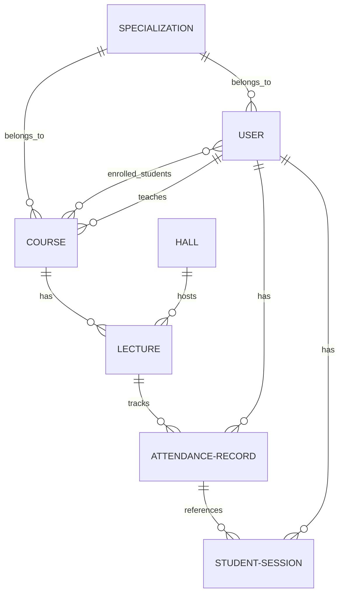
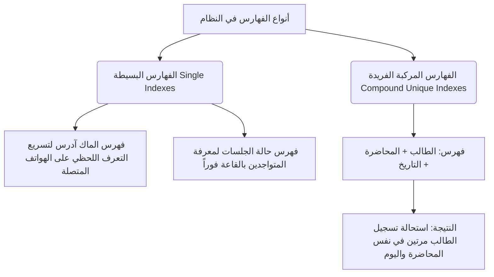
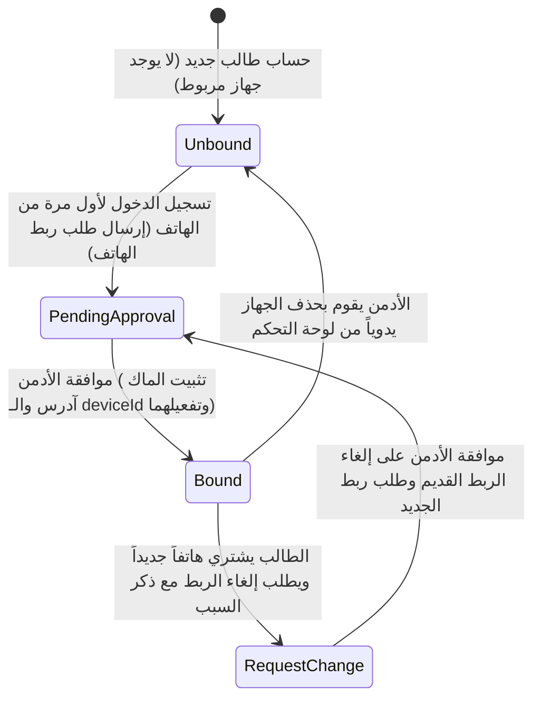

# الفصل الثالث: هيكل البيانات والربط العلائقي (Data Model Logic)

يشرح هذا الفصل معمارية البيانات وهيكلة الجداول (Schemas) في قاعدة البيانات (MongoDB)، ويوضح العلاقات المنطقية التي تربط الكيانات المختلفة ببعضها، ودور الفهارس (Indexes) في تسريع عمليات البحث وضمان تكامل البيانات ومنع التكرار.

---

## 1️⃣ نموذج قاعدة البيانات غير العلائقية (NoSQL MongoDB Model)

تم اختيار قاعدة بيانات **MongoDB** لأنها توفر مرونة عالية في تعديل وتوسيع الحقول دون الحاجة لتعطيل قاعدة البيانات، وهي مناسبة جداً لتخزين سجلات الحضور التي تحتوي على جلسات فرعية متغيرة الطول (`sessions`). وبالرغم من كونها قاعدة بيانات غير علائقية، إلا أن النظام يعتمد على منطق الربط والإشارة (References) لبناء علاقات أكاديمية متينة وصارمة بين الكيانات المختلفة.

---

## 2️⃣ العلاقات المنطقية والربط بين الكيانات (Entity Relationships)

يوضح المخطط التالي كيفية ارتباط النماذج ببعضها في النظام:

### أ) نموذج المستخدم (`User Model`):
يمثل الكيان المركزي في النظام ويحتوي على منطق الأدوار المختلفة:
*   **الطالب (Student):** يحتوي على بيانات المستوى الأكاديمي، التخصص، والكورسات المسجل فيها، بالإضافة إلى منطق **"قفل الجهاز (Device Binding)"** الذي يربط حساب الطالب برمز كارت الشبكة (MAC Address) والمعرّف الفيزيائي لجهازه (`deviceId`) لمنع تسجيل الغياب بالنيابة عن الزملاء.
*   **الأستاذ (Doctor):** يربط الأستاذ بالمواد التي يدرسها والمحاضرات التي يلقيها.
*   **المشرف (Admin):** يحتوي على صلاحيات الإدارة الكاملة أو صلاحيات رئيس القسم (Head of Department) التي تحجم وصوله لقسمه فقط.

### ب) نموذج المقرر الدراسي (`Course Model`):
يربط منطقياً بين:
*   الأستاذ المسؤول عن تدريس المادة.
*   التخصص الأكاديمي والمستوى الدراسي والفرقة المستهدفة.
*   قائمة الطلاب المقيدين رسمياً لدراسة هذه المادة (يستخدمها النظام للتحقق من حق الطالب في تسجيل حضوره بالمحاضرة).

### ج) نموذج القاعة الدراسية (`Hall Model`):
يخزن البيانات الجغرافية والشبكية للقاعة:
*   اسم القاعة ومبناها وسعتها الاستيعابية.
*   بيانات جهاز الميكروتيك المربوط بها: عنوان الماك الفيزيائي الخاص بالراوتر، معرّف القاعة (`apIdentifier`) الذي يرسله السكريبت، ومفتاح الأمان المشترك (`apiKey`) لتوثيق الطلبات.

### د) نموذج المحاضرة المجدولة (`Lecture Model`):
يمثل التوقيت الزمني والأكاديمي؛ حيث يربط الكورس بالقاعة بالدكتور بيوم الأسبوع ووقت البداية والنهاية. ويحتوي على حقول لتثبيت أوقات البدء والانتهاء الفعلية التي يحددها الدكتور يدوياً عند الضغط على أزرار التحكم.

### هـ) نموذج الجلسة النشطة (`StudentSession Model`):
كيان مؤقت وحركي يتتبع حالة الطالب المتصل بالواي فاي في اللحظة الحالية:
*   يربط الطالب بالقاعة والمحاضرة وسجل الحضور الذي يقوم بالدفع فيه.
*   يحتوي على علامة منطقية (`isActive`) تدل على ما إذا كان الطالب متصلاً بالشبكة الآن أم أنه غادر وتوقف اتصاله.

### و) نموذج سجل الحضور اليومي (`AttendanceRecord Model`):
الوثيقة الأكاديمية النهائية للطالب عن كل محاضرة في يوم محدد.
*   يحتوي على مصفوفة جلسات فرعية (`sessions`) تسجل وقت كل دخول (Check-in) وكل خروج (Check-out) للطالب خلال المحاضرة.
*   يخزن إجمالي الدقائق الفعلية لوجود الطالب، والنسبة المئوية المحسوبة، والقرار النهائي المعتمد لحالة الطالب (حاضر/غائب).

---

## 3️⃣ منطق الفهارس وتكامل البيانات (Database Indexes & Integrity)

لضمان عمل النظام بسرعة فائقة حتى مع وجود آلاف السجلات اليومية، وتجنب حدوث أخطاء برمجية أو تكرار في الحساب، يعتمد منطق البيانات على نوعين من الفهارس (Indexes):

### أ) الفهارس البسيطة (Single Indexes):
*   **فهرس الماك آدرس على نموذج المستخدم:** عند استقبال السيرفر لحدث اتصال واي فاي يحتوي على ماك آدرس، يجب أن يتعرف على الطالب المرتبط به في أجزاء من الثانية. هذا الفهرس يمنع فحص ملايين السجلات في قاعدة البيانات ويبحث مباشرة عن المالك.
*   **فهرس الجلسات النشطة:** مسح الجلسات النشطة باستمرار لمعرفة من متواجد حالياً في القاعة لتحديث شاشة الدكتور الفورية.

### ب) الفهارس المركبة الفريدة (Compound Unique Indexes):
*   **منع التكرار الحتمي:** في قواعد البيانات الكبيرة، قد يرسل الميكروتيك طلب دخول متزامن مرتين لنفس الطالب بسبب تذبذب الإشارة، مما قد يؤدي لإنشاء سجلي حضور لنفس المحاضرة لنفس الطالب في نفس اليوم.
*   **الحل المنطقي:** تم إنشاء فهرس مركب يدمج ثلاثة حقول معاً كمعرف فريد لا يمكن تكراره مطلقاً في قاعدة البيانات:
    $$\text{Unique Identifier} = \{\text{Student ID}\} + \{\text{Lecture ID}\} + \{\text{Date}\}$$
*   إذا حاول السيرفر إدخال سجل حضور جديد لنفس الطالب والمحاضرة واليوم، تقوم قاعدة البيانات برفض الطلب تلقائياً وتنبيه النظام ليركز على تحديث السجل القائم بدلاً من إنشاء واحد جديد.

---

## 4️⃣ تقنية إلغاء التقييس السريع (Denormalization Logic)

تعتمد قواعد البيانات العلائقية على فصل الجداول وتجنب تكرار كتابة الحقول. ولكن في نظام الحضور والغياب، نحتاج لسرعة خارقة أثناء جدولة المحاضرات وفحص التعارضات في ثوانٍ معدودة.

*   **منطق المعالجة:** عند إنشاء محاضرة مجدولة (`Lecture`)، يقوم النظام تلقائياً بنسخ حقول (المستوى الدراسي وتخصص المادة) من نموذج المقرر الدراسي وحفظها مباشرة داخل نموذج المحاضرة بشكل مكرر.
*   **الفائدة المنطقية:** عند قيام السيرفر بالتحقق من جدول اليوم للبحث عن تعارضات، أو عند بحث تطبيق الموبايل عن جدول فرقة دراسية معينة، فإنه يقرأ البيانات مباشرة من جدول المحاضرات دون الحاجة للقيام بعمليات ربط معقدة ومستهلكة للوقت والطاقة (Database Joins / Lookups) مع جدول الكورسات، مما يزيد من سرعة واستجابة النظام بشكل كبير.

---

## 5️⃣ منطق توثيق وقفل الأجهزة (Device Binding State Flow)

لمنع احتيال الطلاب بتسجيل زملائهم عبر فتح حساباتهم من هواتفهم الشخصية، يعتمد النظام على دورة حياة محكمة لقفل الأجهزة (Device Binding Flow):

1.  **حالة عدم الارتباط (Unbound):** الطالب الجديد ليس لديه أي ماك آدرس مسجل في النظام.
2.  **طلب الارتباط الأول (Pending Binding):** عند تسجيل دخول الطالب لأول مرة من تطبيق الموبايل، يقوم التطبيق بقراءة المعرف الفريد للجهاز (`deviceId`) وإرساله، ويُنشأ طلب ربط قيد الانتظار.
3.  **الارتباط الموثق (Bound & Verified):** يقوم الأدمن بمراجعة الطلب والموافقة عليه؛ في هذه اللحظة يتم قفل الحساب على هذا الهاتف فقط وتصبح قيمة التوثيق (`isVerified = true`). لا يمكن للطالب تسجيل الدخول من أي هاتف آخر، ولا يمكن لأي طالب آخر استخدام هذا الهاتف.
4.  **طلب تغيير الجهاز (Device Change Request):** في حال تلف هاتف الطالب أو شرائه لجهاز جديد، يقوم بإرسال طلب تغيير مع ذكر المبررات (مثال: "تغيير الهاتف الشخصي"). يظل الطلب معلقاً ولا يتم تفعيل الجهاز الجديد إلا بعد قيام الأدمن بإلغاء ارتباط الجهاز القديم والموافقة على الجديد، مما يسد أي ثغرة للتلاعب بالحضور.
