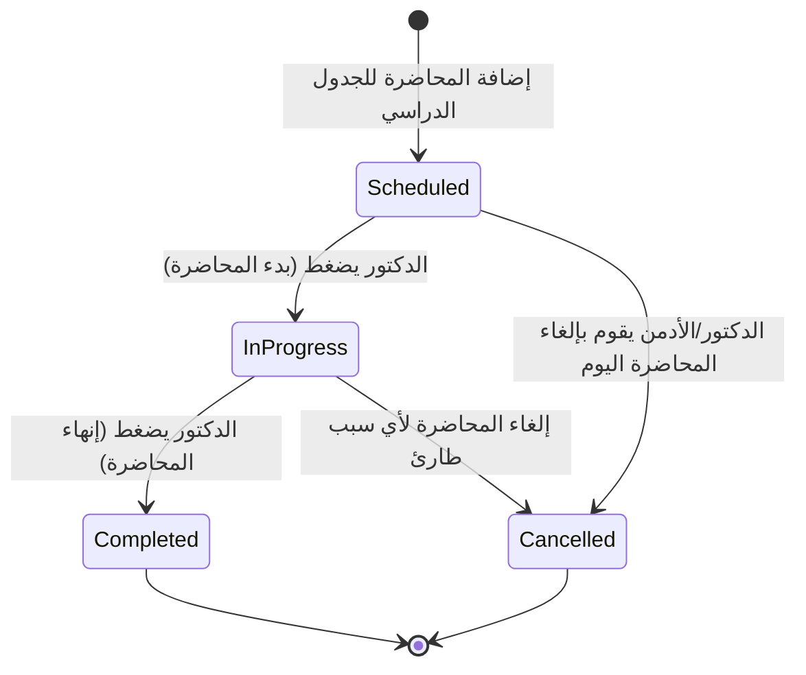
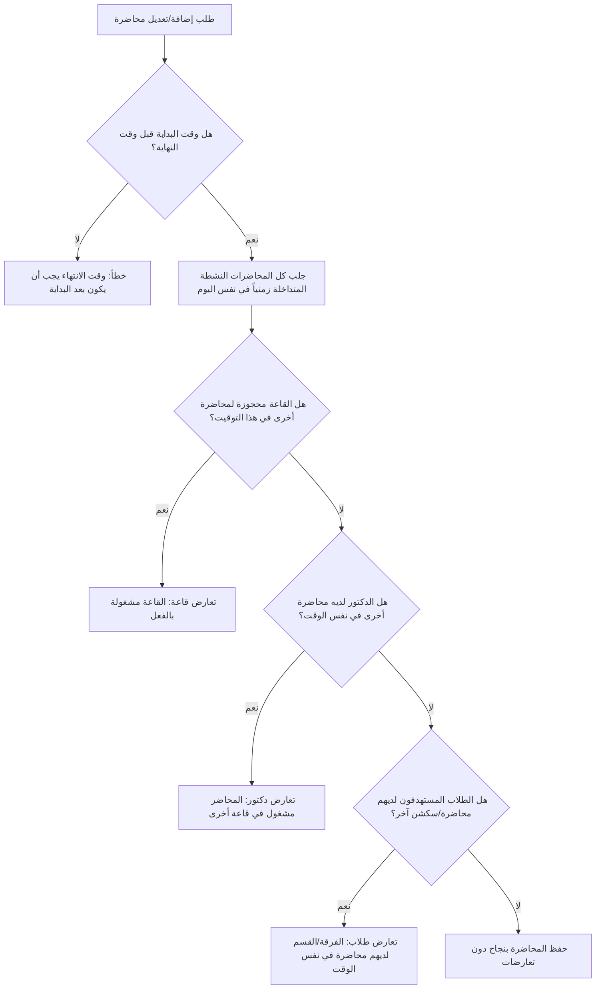

# الفصل الرابع: محرك حضور المحاضرة ونسب الغياب (Lecture & Attendance Engine Logic)

يشرح هذا الفصل منطق عمل محرك الجدولة وتحديد الغياب في النظام. يركز الفصل على كيفية كشف ومنع تعارض المواعيد عند جدولة المحاضرات، وكيفية حساب النسبة المئوية للحضور الفعلي للطالب بدقة متناهية بناءً على دورة حياة المحاضرة وجلسات الاتصال المتعددة بالواي فاي.

---

## 1️⃣ دورة حياة المحاضرة المجدولة (Lecture Lifecycle States)

تمر كل محاضرة في النظام بـ 4 حالات منطقية أساسية تحركها إجراءات الدكتور في لوحة التحكم وتدفق أحداث الميكروتيك:

1.  **مجدولة (Scheduled):** الحالة الافتراضية عند إنشاء الجدول الدراسي للفرقة. المحاضرة خاملة شبكياً؛ لا تستقبل حضوراً ولا ترصد جلسات.
2.  **قيد التنفيذ (In-Progress):** تبدأ بمجرد ضغط الدكتور على زر "بدء المحاضرة". في هذه الحالة، تصبح القاعة نشطة في استقبال أحداث الواي فاي من الميكروتيك، ويتم إنشاء وتحديث سجلات حضور الطلاب تلقائياً.
3.  **مكتملة (Completed):** تنتهي بضغط الدكتور على زر "إنهاء المحاضرة". هنا يقوم النظام بحساب نسب الغياب والحضور النهائية وتثبيت السجلات وغلق المحاضرة شبكياً.
4.  **ملغاة (Cancelled):** حالة طارئة في حال إلغاء المحاضرة لظرف ما؛ حيث يتجاهل السيرفر أي أحداث واي فاي تصل من هذه القاعة في هذا التوقيت.

---

## 2️⃣ منطق محرك كشف التعارضات (Conflict Resolution Engine)

عند قيام الأدمن بإنشاء أو تعديل محاضرة في الجدول الدراسي، يتم تشغيل خوارزمية ذكية للتحقق من ثلاثة أنواع من تعارضات الوقت في نفس اليوم الدراسي لمنع حدوث مشاكل في التوزيع:

### أ) تعارض القاعة (Hall Conflict):
يمنع حجز قاعة واحدة لمحاضرتين مختلفتين في نفس التوقيت الدراسي، مما يضمن ألا تتداخل إشارات الميكروتيك أو يتواجد دكتوران في نفس المكان في نفس الوقت.

### ب) تعارض المحاضر (Doctor Conflict):
يتحقق من جدول المحاضر المسؤول عن المادة؛ فإذا كان يلقي محاضرة أخرى في قاعة ثانية في نفس التوقيت، يرفض النظام الحجز وينبه المشرف بضرورة تعديل الجدول.

### ج) تعارض الطلاب (Student / Section Conflict):
يتحقق من الفرقة الدراسية (Level) والتخصص (Specialization) والقسم (Department)، وأيضاً الشعبة أو السكشن (Section).
*   **لوجك التحقق:**
    *   إذا كانت المحاضرة مستهدفة للفرقة كاملة (محاضرة عامة)، لا يسمح بوجود أي محاضرة أخرى لطلاب نفس الفرقة في نفس الوقت.
    *   إذا كانت المحاضرة مخصصة لسكشن معين (مثال: سكشن 1)، يسمح بجدولة سكشن آخر (مثال: سكشن 2) في نفس التوقيت في قاعة أخرى، ولكنه يمنع حجز محاضرتين لنفس السكشن في نفس الوقت.

---

## 3️⃣ خوارزمية حساب الحضور والغياب بالتفصيل

يقوم السيرفر بحساب الحضور بناءً على المعادلة الرياضية الصارمة لوقت الوجود الفعلي مقارنة بالمدة الفعلية للمحاضرة:

### أ) حساب المدة الفعلية للمحاضرة ($\text{Lecture Duration}$):
يتم حساب المدة الفعلية بالدقائق بناءً على وقت البدء الفعلي ووقت النهاية الفعلي:
$$\text{المدة الفعلية للمحاضرة} = \text{وقت النهاية الفعلي} - \text{وقت البدء الفعلي} \quad (\text{بالدقائق})$$
*   *ملاحظة منطقية:* إذا كانت المدة المحسوبة أقل من دقيقة واحدة لأسباب تجريبية، يتم اعتبارها دقيقة واحدة كحد أدنى لتجنب القسمة على صفر في العمليات الحسابية.

### ب) حساب وقت وجود الطالب المتراكم ($\text{Total Presence Time}$):
لأن هاتف الطالب قد ينفصل ويتصل عدة مرات خلال المحاضرة (خروج مؤقت، ضعف شبكة، إغلاق الواي فاي)، يحتوي سجل الطالب على قائمة بكل جلسات الدخول والخروج الفرعية.
*   **منطق الحساب:**
    1.  يمر النظام على كل جلسة فرعية للطالب داخل السجل اليومي.
    2.  يقوم بحساب مدة كل جلسة على حدة:
        $$\text{مدة الجلسة} = \text{وقت الخروج (Check-out)} - \text{وقت الدخول (Check-in)} \quad (\text{بالدقائق})$$
    3.  إذا كانت الجلسة الأخيرة مفتوحة (أي أن الطالب كان متصلاً حتى لحظة إنهاء المحاضرة)، يتم اعتبار وقت إنهاء المحاضرة كـ (Check-out) افتراضي لإغلاق الجلسة وحساب مدتها.
    4.  يتم جمع مدد كل الجلسات الفرعية للحصول على الوقت المتراكم:
        $$\text{الوقت المتراكم} = \sum (\text{مدد الجلسات الفرعية})$$

### ج) حساب النسبة المئوية للحضور وإصدار الحكم النهائي:
يحسب النظام النسبة المئوية كالتالي:
$$\text{النسبة المئوية للحضور} = \left( \frac{\text{وقت وجود الطالب المتراكم}}{\text{المدة الفعلية للمحاضرة}} \right) \times 100$$
*   **تطبيق حد القبول (Threshold):**
    يقارن النظام النسبة المحسوبة بالقيمة المخزنة في الإعدادات العامة للنظام (`MIN_PRESENCE_PERCENTAGE` والتي تكون افتراضياً 50%):
    *   إذا كانت $\text{النسبة المحسوبة} \ge 50\%$، يتم تصنيف الطالب رسمياً كـ **حاضر (Present)**.
    *   إذا كانت $\text{النسبة المحسوبة} < 50\%$، يتم تصنيف الطالب رسمياً كـ **غائب (Absent)**.

---

## 4️⃣ منطق الانتقال التلقائي للشبكة (Session Auto-Transition Logic)

أحد أهم التحديات التي تم حلها منطقياً هي ظاهرة **"المحاضرات المتتالية في نفس القاعة"**.
*   **المشكلة:** إذا كان لدى الطلاب محاضرة مادة "شبكات" تليها مباشرة محاضرة مادة "ذكاء اصطناعي" في نفس القاعة، فإن هواتف الطلاب تظل متصلة بالواي فاي الخاص بالميكروتيك دون أي انقطاع. الميكروتيك لن يرسل حدث دخول جديد (`device-connected`) مع بداية المحاضرة الثانية لأن الأجهزة متصلة بالفعل ولم تنفصل.
*   **الحل المنطقي (Auto-Transition):**
    1.  عند قيام الدكتور الأول بإنهاء محاضرته، يقوم السيرفر بحساب نسب حضور الطلاب وإغلاق سجلاتهم بشكل طبيعي.
    2.  **ولكن**، يتم الحفاظ على الجلسات الفيزيائية النشطة للطلاب (`StudentSession`) في قاعدة البيانات مع وسمها بـ (`isActive = true`) طالما أن الميكروتيك لم يرسل حدث خروج لهواتفهم.
    3.  عندما يقوم الدكتور الثاني ببدء محاضرته الجديدة في نفس القاعة، يقوم السيرفر بالتحقق الفوري من قاعدة البيانات: "ما هي الجلسات النشطة في هذه القاعة حالياً؟".
    4.  يسحب السيرفر قائمة الطلاب المتواجدين بالقاعة، ويقوم تلقائياً بإنشاء سجلات حضور جديدة لهم للمادة الثانية وربطها بجلساتهم المفتوحة.
    5.  بذلك، يُسجل حضور الطلاب في المحاضرة الثانية تلقائياً دون أن يضطروا للمس هواتفهم أو إعادة الاتصال بالشبكة.
