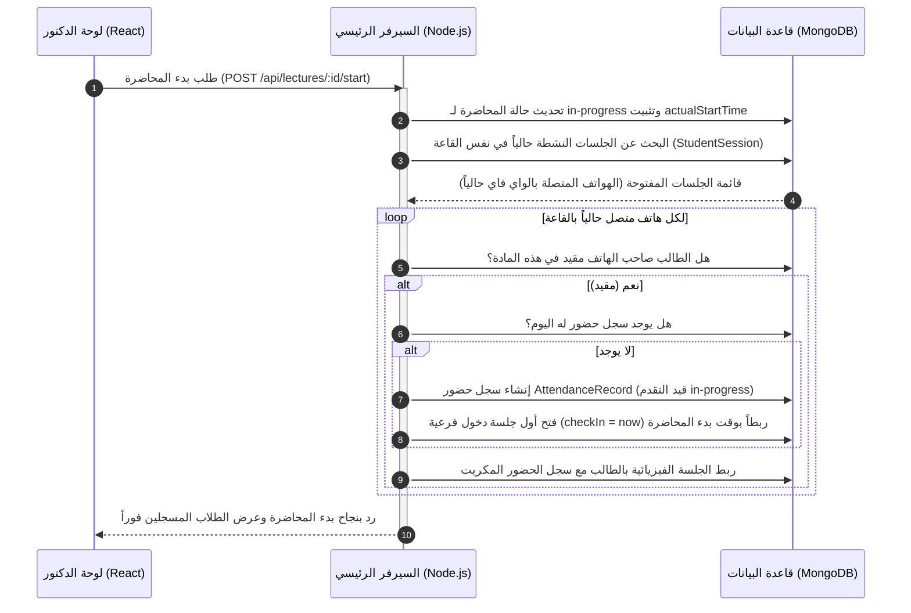
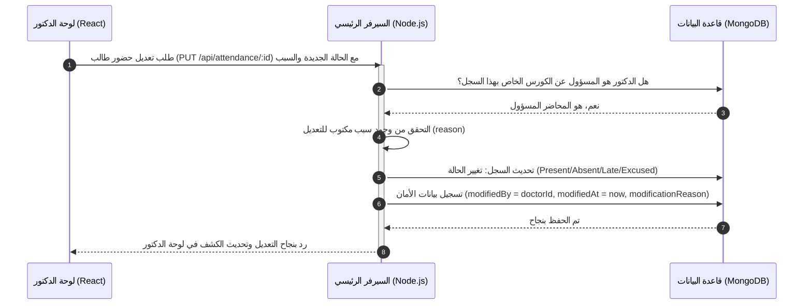

# الفصل السادس: شاشات لوحة تحكم الدكتور والتفاعل الفعلي للحاضرين (Doctor Dashboard & Realtime Logic)

يا أهلاً بيك يا بطل في الفصل السادس! في الجزء ده من الدليل، هنركز على لوحة تحكم الدكتور (Doctor Dashboard)، وهي الجزء الحركي اللي بيتفاعل معاه أستاذ المادة أثناء وجوده في القاعة الدراسية. هنشرح بالبلدي وبالتفصيل الممل إزاي الزراير والشاشات دي بتتحكم في "محرك الحضور" في الـ Backend وقاعدة البيانات وتعدل سجلات الطلاب لحظة بلحظة.

---

## 1️⃣ معمارية لوحة الدكتور والتحقق من الهوية (Doctor Auth & Role Guard)

لوحة الدكتور مبنية برضه بتقنية **React + Vite + TypeScript**، وبتشترك مع لوحة الأدمن في نفس نظام المصادقة الأمنية القائم على الـ **HTTP-Only Cookies (JWT)**.
*   **منطق التحقق من الصلاحية (Doctor Role Guard):**
    لما الدكتور يفتح اللوحة، السيرفر بيمرر طلباته على برمجية وسيطة (Middleware) بتتأكد إن حقل الدور (`role`) في حسابه هو `doctor`. لو حاول يدخل على صفحات الإدارة، السيستم بيطرده. وبنفس المنطق، السيرفر بيحمي بيانات المواد؛ يعني مستحيل دكتور "مادة أ" يقدر يشوف أو يعدل غياب طلاب "مادة ب" لو هو مش مدرسها، وده حماية تامة للداتا من التلاعب غير المقصود.

---

## 2️⃣ شاشة الداشبورد الرئيسية وجدول المحاضرات (`dashboard.tsx` & `my-schedule`)

عند دخول الدكتور، بتظهرله الواجهات الأساسية المخصصة لجدوله اليومي:

*   **شاشة الداشبورد الرئيسية:**
    *   بتعرض المقررات (Courses) اللي الدكتور ده بيدرسها حالياً فقط (عن طريق استعلام السيرفر لجدول المقررات بفلتر `doctor = doctorId`).
    *   بتعرض بطاقة سريعة فيها "المحاضرة النشطة الآن" أو "المحاضرة القادمة" مع عداد تنازلي لوقت المحاضرة.
*   **شاشة جدولي الدراسي (`my-schedule`):**
    *   بتعرض الجدول الأسبوعي للدكتور مقسماً على الأيام والساعات والقاعات، عشان يعرف القاعة اللي هيتوجه ليها ومجهزة بأنهي أكسس بوينت.

---

## 3️⃣ شاشة إدارة الحضور والتفاعل الفوري (Live Attendance Monitoring & Control)

دي الشاشة الأهم للدكتور واللي فيها كل التفاعل الحركي واللوجك الفعلي:

### أ) لوجك شاشة الحضور الفوري (Real-time Live Feed):
أثناء المحاضرة، وقبل ما تنتهي وقبل ما يتحسب الغياب النهائي، الدكتور بيشوف على الشاشة قايمة بأسماء الطلاب وهواتفهم اللي متصلة بالواي فاي بتاع القاعة دلوقتي حالا.
*   **منطق العمل في الخلفية:** الصفحة بتعمل طلب دوري (Polling) أو استعلام مستمر للسيرفر، والسيرفر بيروح يدور في جدول الجلسات النشطة (`StudentSession`) في القاعة دي حالياً، ويجيب أسماء الطلاب المرتبطين بالماك آدرسز المتصلة ويعرضهم لايف للدكتور، فالدكتور يقدر يطابق اللي قاعدين قدامه في المدرج باللي ظاهرين على الشاشة.

---

## 4️⃣ لوجك زر "بدء المحاضرة" يدوياً (Manual Start Flow)

لما الدكتور يدخل القاعة ويحب يبدأ المحاضرة قبل ميعادها أو في ميعادها، بيضغط على زرار **"بدء المحاضرة"**. يوضح المخطط التالي اللوجك المعقد اللي بيحصل في الباك إند خلف الزرار ده:

### شرح العمليات بالتفصيل:
1.  **تغيير حالة المحاضرة:** السيرفر بيحدث مستند المحاضرة في قاعدة البيانات؛ بيغير حالتها إلى `in-progress` ويسجل الوقت الحالي كبداية فعلية للمحاضرة (`actualStartTime = new Date()`).
2.  **سحب الطلاب المتصلين أوتوماتيكياً (Auto-Catching):**
    السيرفر بيروح فوراً لجدول الجلسات النشطة (`StudentSession`) ويدور على كل الطلاب اللي تليفوناتهم متصلة بالواي فاي بتاع القاعة دي في اللحظة دي.
3.  **فلترة وتسكين الحضور:**
    لكل طالب متصل، بيشوف لو مقيد في المادة؛ بيكريت له سجل حضور يومي للمحاضرة دي (`AttendanceRecord`) ويبدأ له جلسة حضور فرعية (Check-in) بتبدأ من وقت الضغط على زرار البدء، وبكده الطالب اللي جه بدري وقعد في القاعة بيتحسب له الوجود من أول ثانية بدأت فيها المحاضرة أوتوماتيك من غير ما يعمل أي حاجة.

---

## 5️⃣ لوجك زر "إنهاء المحاضرة" يدوياً واحتساب الحضور (Manual End Flow)

لما المحاضرة تخلص، الدكتور بيضغط زرار **"إنهاء المحاضرة"** في لوحة التحكم. دي أهم عملية حسابية في السيستم بالكامل، وبتتم كالتالي:

1.  **تثبيت المواعيد الفعلية:** السيرفر بيحدث المحاضرة؛ يغير حالتها لـ `completed` ويسجل وقت النهاية الفعلي (`actualEndTime = new Date()`).
2.  **حساب مدة المحاضرة الكلية بالدقائق:**
    $$\text{مدة المحاضرة الفعلية} = \text{وقت النهاية الفعلي} - \text{وقت البدء الفعلي} \quad (\text{بالدقائق})$$
3.  **معالجة كشوف الحضور للطلاب المعلقين:**
    السيرفر بيجلب كل سجلات الحضور اللي حالتها لسه "قيد التقدم" (`in-progress`) للمحاضرة دي اليوم:
    *   **إغلاق الجلسات المفتوحة:** لو الطالب انتهت المحاضرة وهو لسه قاعد في المدرج وتلفونه متصل، السيرفر بيقفل جلسته الفرعية الأخيرة ويخلي وقت خروجها هو وقت إنهاء المحاضرة، ويحسب مدتها ويزودها على وقته الكلي المتراكم (`totalPresenceTime`).
    *   **حساب النسبة المئوية:**
        $$\text{نسبة حضور الطالب} = \left( \frac{\text{إجمالي وقت وجود الطالب بالدقائق}}{\text{مدة المحاضرة الفعلية بالدقائق}} \right) \times 100$$
    *   **اتخاذ القرار النهائي (حاضر/غائب):**
        بيقرأ السيرفر نسبة القبول (مثلاً 50%)؛ لو نسبة الطالب أكبر أو تساويها، بيتغير حالته لـ **حاضر (Present)**، لو أقل بيعلم عليه **غائب (Absent)**.
    *   **التثبيت والتأمين:** بيعلم السجل كـ `isFinalized = true` عشان محدش يقدر يغير فيه تلقائياً تاني.

---

## 6️⃣ منطق التعديل اليدوي لحضور الطلاب (Manual Override & Audit Trail)

في بعض الأحيان، طالب بيحصل معاه ظرف استثنائي (موبايله بطاريته فضيت، نسيه في البيت، أو معاه عذر طبي مقبول من الإدارة). هنا بيتدخل الدكتور ويعدل حالته يدوي:

### شرح العمليات الفنية للتعديل اليدوي:
1.  **حماية الصلاحيات:** لما الدكتور يختار طالب ويغير حالته (مثلاً من غائب لحاضر أو لعذر مقبول) ويكتب السبب، الطلب بيروح على الـ API. السيرفر بيتأكد إن الدكتور ده هو المالك الفعلي للمادة، لو دكتور تاني بيحاول يعدل لمادة مش بتاعته الطلب بيترفض أوتوماتيك لضمان النزاهة.
2.  **تسجيل الأثر والمساءلة (Audit Trail Logic):**
    مستحيل تعديل حالة الحضور يدوي بدون ترك أثر. قاعدة البيانات بتلزم السيرفر بتخزين البيانات دي في مستند الحضور (`AttendanceRecord`):
    *   الحالة الجديدة المطلوبة.
    *   **`modifiedBy`**: تخزينObjectId بتاع الدكتور اللي قام بالتعديل.
    *   **`modifiedAt`**: تاريخ ووقت التعديل بالثانية.
    *   **`modificationReason`**: السبب اللي الدكتور كتبه يدوياً (مثال: "نسي الهاتف وقدم كشف ورقي").
    *   اللوج ده بيفيد الإدارة والعميد في مراجعة التعديلات والتأكد من عدم وجود مجاملات أو تلاعب في كشوف الغياب والإنذارات.

---

## 7️⃣ كشوف الطلاب والتقارير الأكاديمية (Course Reports & Analytics)

*   **شاشة كشوف الطلاب:** تتيح للدكتور استعراض قائمة الطلاب المقيدين في كورساته ورؤية متوسط حضور كل طالب بشكل فردي.
*   **استخراج التقارير:** توفر لوحة الدكتور إمكانية تصدير تقارير الحضور والغياب بصيغ (Excel/PDF) لإرسالها لإدارة الكلية وشؤون الطلاب لاعتمادها في أعمال السنة أو اتخاذ قرارات الحرمان بنهاية الفصل الدراسي.
