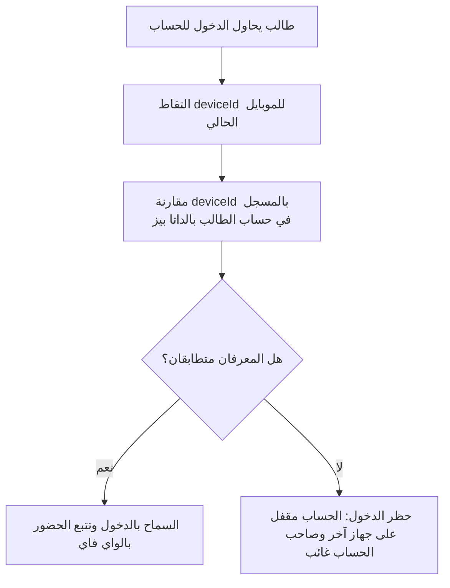
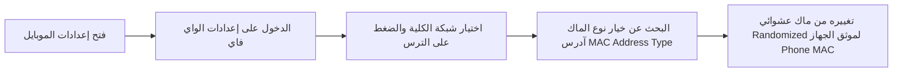

# الفصل السابع: واجهات تطبيق الهاتف وحماية النظام من الاحتيال (Mobile App & Anti-Fraud Security)

يا هلا بيك يا بطل في الفصل السابع والأخير! في الجزء ده من الدليل، هنتكلم عن تطبيق الموبايل اللي بيستخدمه الطلاب (Mobile App) والترسانة الدفاعية والمنطقية اللي عملناها لحماية النظام من أي محاولات غش أو تلاعب بالحضور والغياب (Anti-Fraud Logic). 

هنفهم اللوجك اللي بيحمي النظام برضه بالبلدي وبالتفصيل التام اللي متعودين عليه.

---

## 1️⃣ واجهات تطبيق الموبايل ودورة حياة الاستخدام للطلاب (Mobile App Flows)

تطبيق الموبايل هو النافذة الوحيدة للطالب للتفاعل مع النظام، وهو مبني عشان يقوم بالوظائف دي:

### أ) شاشة تسجيل الدخول والارتباط الأول (First-time Login & Device Binding):
*   **لوجك الدخول:** الطالب بيكتب الكود الأكاديمي والباسورد.
*   **التقاط هوية الهاتف:** بمجرد الضغط على تسجيل الدخول، التطبيق بيقرا أوتوماتيك من نظام التشغيل حاجتين:
    1.  المعرف الفريد للجهاز (`deviceId`).
    2.  الماك آدرس الحقيقي لكارت الواي فاي الخاص بالموبايل (`macAddress`).
*   **طلب التوثيق:** لو ده أول دخول للطالب، السيرفر بيحط البيانات دي في حالة "انتظار الموافقة" (`pending`) لحد ما الأدمن يفعلها من لوحة التحكم.

### ب) شاشة تتبع الجلسة الحالية والحضور اللحظي (`current-session`):
*   لما الطالب يقعد في القاعة، بيفتح التطبيق عشان يتطمن إنه متحضر.
*   **اللوجك الخلفي:** التطبيق بيبعت طلب للسيرفر (`GET /api/mobile/current-session`). الباك إند بيروح يدور في جدول الجلسات النشطة (`StudentSession`)؛ لو لقى جلسة نشطة للطالب ده مربوطة بالقاعة اللي هو قاعد فيها، بيرد على الموبايل ببيانات المحاضرة والدكتور، والتطبيق يعرض رسالة خضرا مريحة: **"أنت متصل بالشبكة ومسجل حضورك حالياً في محاضرة مادة [اسم المادة] بالقاعة [اسم القاعة]"**.

### ج) شاشة سجل الحضور والغياب (Attendance History):
*   شاشة بتعرض للطالب كشف الحساب الأكاديمي لنسب غيابه في كل المقررات، وبيانات كل يوم وتاريخ حضر فيه أو غاب، عشان الطالب يتابع غيابه بنفسه وميتفاجئش بقرار الحرمان في آخر السنة.

---

## 2️⃣ ترسانة مكافحة الغش والاحتيال وتأمين النظام (Anti-Fraud Security Suite)

بما إن الحضور بيتم أوتوماتيكياً من غير تدخل بشري، فكان لازم نحط قيود أمنية صارمة جداً تمنع أي محاولات للالتفاف على السيستم. دي الدفاعات اللي مأمنة مشروعك:

### أ) منطق قفل الهاتف والحساب (Device Binding Rule):
*   **المشكلة:** ممكن طالب يغيب من الكلية، ويدي حسابه وباسورده لزميله اللي حاضر، وزميله يسجل دخول بحساب صاحبه من موبايله الشخصي عشان يحضره معاه وهو غايب.
*   **الحل المنطقي:** بمجرد ما الأدمن يوافق على ربط حساب الطالب بجهازه، بيتخزن الـ `deviceId` والـ `macAddress` في مستند الطالب. 
*   لو حاول أي طالب يفتح حسابه من موبايل زميله، السيرفر بيقارن الـ `deviceId` بتاع الموبايل الجديد باللي متسجل في الداتا بيز؛ ولما يلاقيهم مختلفين، بيقفل الدخول فوراً ويطلع رسالة: **"عذراً! هذا الحساب مقيد بجهاز آخر، لا يمكنك الدخول من هذا الهاتف"**. وبكده مستحيل تليفون واحد يحضر طالبين في نفس الوقت!

---

## 3️⃣ حل مشكلة الماك آدرس العشوائي (Randomized MAC Address Issue)

دي كانت أكبر عقبة تقنية بتواجه أنظمة الحضور المعتمدة على الواي فاي، وحلناها بلوجك تعليمي ذكي:

### أ) المشكلة (Random MAC):
الموبايلات الحديثة (أندرويد وآيفون) كنوع من حماية الخصوصية، لما بتيجي تتصل بأي شبكة واي فاي بتخفي الماك آدرس الفيزيائي الحقيقي بتاعها، وتولد ماك آدرس وهمي وعشوائي (Randomized MAC) يتغير كل فترة. 
*   **النتيجة السيئة:** الميكروتيك هيلقط الماك العشوائي ويبعته للسيرفر، والسيرفر هيدور عليه في الداتا بيز ومش هيلاقيه لأننا مسجلين الماك الحقيقي للطالب، فالطالب هيتحسب غايب وهو قاعد في نص المدرج!

### ب) الحل البرمجي والتعليمي داخل التطبيق:
التطبيق بيشرح للطلاب إزاي يقفلوا الميزة دي للشبكة الخاصة بالكلية تحديداً عبر الخطوات دي:

بمجرد ما الطالب يغير الخيار ده لـ **(ماك الجهاز الحقيقي Phone MAC)**، الموبايل بيبطل يولد ماكات عشوائية ويبعت إشارته الفيزيائية الحقيقية الثابتة، فالميكروتيك يلقطها والسيرفر يطابقها فوراً ويسجله حضور بنجاح.

---

## 4️⃣ التحقق الشبكي المزدوج وتأمين قنوات الاتصال (Double Network Verification)

عشان نضمن إن مفيش هاكر أو طالب محترف يعمل محاكاة (Emulation) للطلبات ويبعتها للسيرفر من بيته، حطينا طبقات تأمين قوية:

1.  **توثيق الأكسس بوينت (AP API Key Authentication):**
    مسار استقبال الأحداث في الباك إند (`POST /api/connections/event`) محمي بـ Middleware اسمها `verifyAccessPoint`. المسار ده مش بيقبل أي داتا إلا لو كانت مصحوبة بالـ `X-API-Key` الخاص بالميكروتيك المتسجل في جدول القاعات. لو طالب حاول يبعت طلب POST وهمي للسيرفر، السيرفر هيرفضه فوراً لأنه ميعرفش المفتاح السري للراوتر.
2.  **عزل شبكة الكلية (IP Subnet Isolation):**
    السيرفر معمول له إعدادات بحيث لا يستجيب لطلبات الحضور والـ API الخاصة بالموبايل إلا لو كان الآي بي بتاع الموبايل يقع في نفس النطاق الشبكي (Subnet) الداخلي اللي بيوزعه الميكروتيك (مثلاً `192.168.88.x`). لو الطالب حاول يبعت أي طلب وهو شغال بـ Data 4G من شريحة الموبايل أو شغال من بيته، السيرفر هيرفض الطلب شبكياً.

---

## 🏁 خاتمة الدليل والملخص العام للمشروع

بانتهاء هذا الفصل، نكون قد قفلنا الدائرة الكاملة لنظام تسجيل الحضور الذكي بالـ WiFi:
*   **المدخلات (Hardware Input):** رقاقة الواي فاي للميكروتيك بتراقب الجو المحيط وتجمع عناوين MAC.
*   **المعالجة البرمجية (Edge & Cloud Processing):** سكريبت الميكروتيك بيبعت الأحداث، والسيرفر بيفك التشفير ويطابق هوية الأجهزة ويشغل محركات الجدولة والتعارضات.
*   **الواجهات وتتبع النتيجة (UI & Analytics):** الأدمن بيتحكم في السيستم، والدكتور بيتابع لايف ويصدر التقارير ويعدل الحالات الاستثنائية، والطالب بيتأكد من حضوره ويحمي حسابه وجهازه.

هذا النظام المتكامل يمثل قفزة نوعية في دقة وسرعة إدارة الحضور الأكاديمي، ومأمن بأحدث معايير الشبكات وقواعد البيانات ومكافحة الاحتيال!
